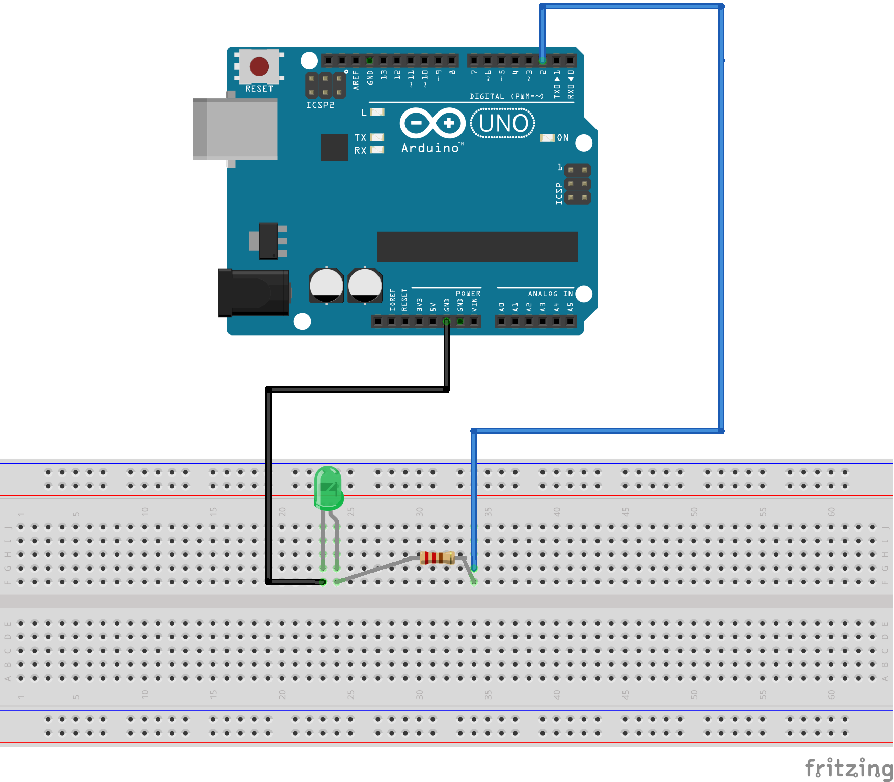

# Rapport Lab2

## Première partie  Fritzing

### Description

Dans le but de notre cours IOT et le projet nous utilisons le logiciel Fritzing pour la modélisation des circuits, a cet effet nous allons apprendre à utiliser le logiciel Fritzing en réalisant l'exercice suivant :

Créer un squelette comprenant 5 composant

* 1 microcontrôleur UNO
* 2 cables
* 1 resistant
* l led

###   Illustration

##### Sketch

##### Shematic

